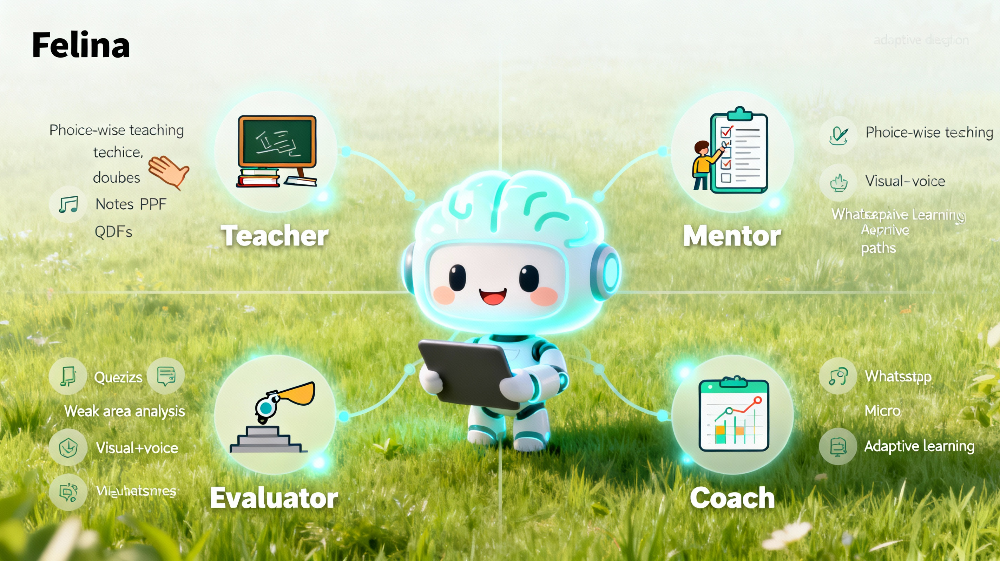
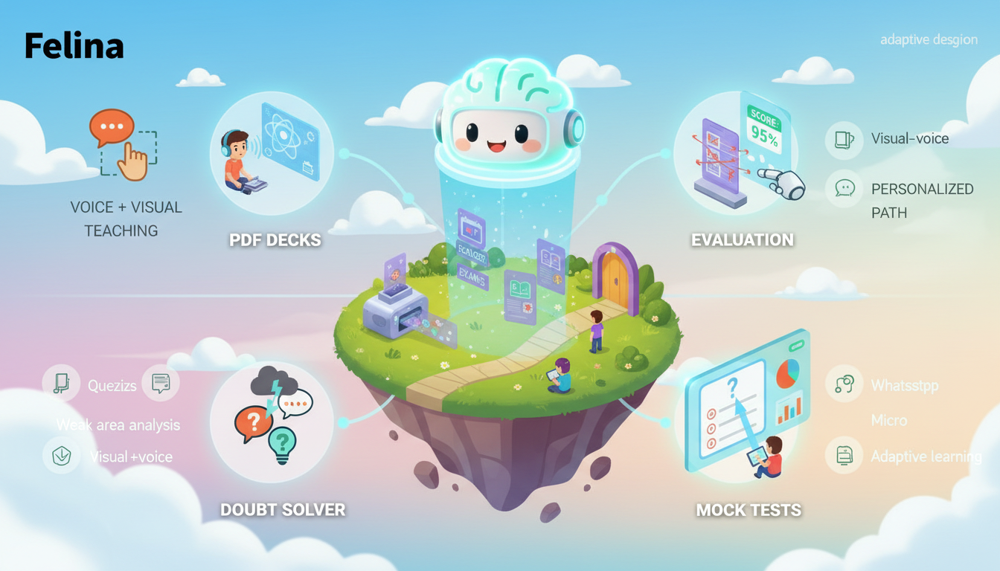
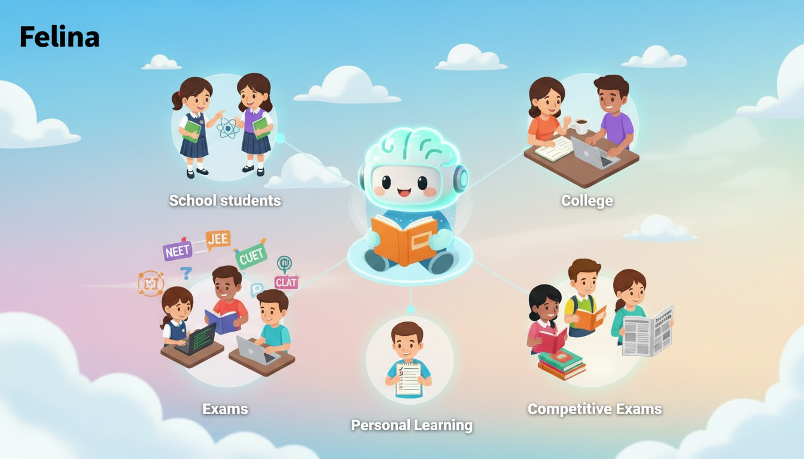
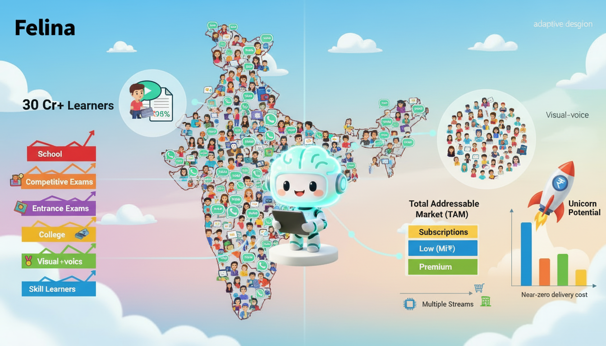
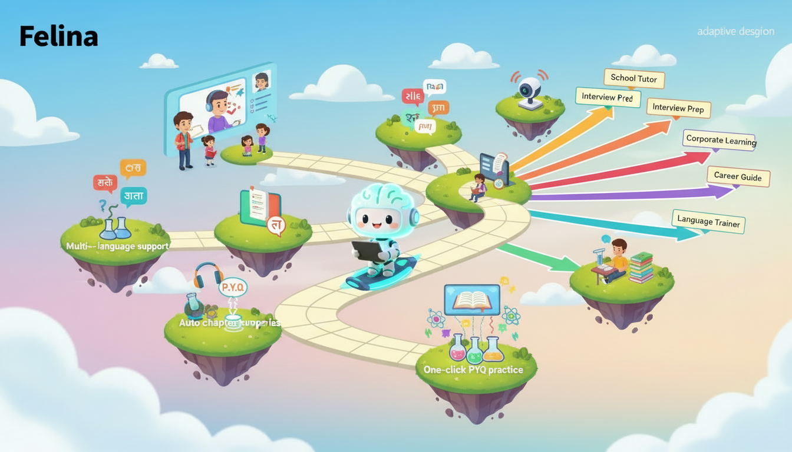

# 🤖 BillianceAI — Felina
## Your 24×7 Personal Teacher — Any Time, Any Subject, Any Learner

Felina is an AI-powered personal teacher that explains, guides, questions, evaluates, motivates, and coaches — just like a real mentor.

It is designed for school students, college learners, entrance exam candidates, competitive exam aspirants, and skill learners.

---

<table>
<tr>
<td width="40%" align="center" valign="middle">

</td>
<td width="80%" valign="top">
  
## 🚀 Overview

Most AI tools give answers.
> **Felina teaches.**

Every learner today struggles with:

- Too much scattered content

- No structured plan

- No personal guidance

- Weak revision

- No feedback

- No performance tracking

> **Felina solves all of these by becoming your 24×7 AI Teacher + Evaluator + Guide + Coach.**

</td>
</tr>
</table>

---

<table>
<tr>
<td width="40%" align="center" valign="middle">

</td>
<td width="60%" valign="top">

## 💡 The Spark — The Innovation
### 🧠 Felina = Teacher + Mentor + Evaluator + Coach

Felina provides:

- Topic-wise conceptual teaching

- Instant doubt solving

- Daily PDF notes & decks

- Mock tests & quizzes

- Answer writing correction

- Weak-area analysis

- Visual + voice explanations

- WhatsApp micro-learning

- Personalized study strategies

- Adaptive learning paths

- A complete universal learning ecosystem for all types of students.

</td>
</tr>
</table>

---

<table>
<tr>
<td width="40%" align="center" valign="middle">

</td>
<td width="60%" valign="top">
  
## ✨ Key Features
### 🎙️ Voice + Visual Hybrid Teaching

Concepts explained through voice notes + diagrams/visuals for deeper clarity.

- 📄 Auto-Generated Study Decks

- PDFs aligned to:

- School Syllabus: CBSE, ICSE, State Boards (6–12)

- College Subjects: Engineering, Arts, Commerce, Management

- Entrance Exams: NEET, JEE, CUET, CLAT

- Competitive Exams: UPSC, TNPSC, SSC, Banking

- 📝 Answer Evaluation

- Upload any answer → Felina evaluates → scores → suggests improvements.

- 🧭 Personalized Learning Path

- AI adjusts your next-day plan based on performance & weak areas.

- 🤖 Doubt Solver

- 🧪 Smart Mock Tests

- Daily, weekly, topic-wise quizzes with instant analytics.

> **From NCERT → PYQs → college textbooks → assignments → competitive exams.**

---

## 🎬 Experience Flow

- Ask a doubt

- Felina explains with voice + visuals

- Receives a short PDF summary

- Takes a practice test

- Tracks accuracy + concepts

- Updates tomorrow’s plan

- Repeats until mastery ✔️

</td>
</tr>
</table>

---

## 🎯 Benefits

- Faster conceptual clarity

- Stronger retention

-Daily incremental improvement

- Complete syllabus guidance

- 24×7 availability

- Clear revision structure

- Visual + voice learning advantage

---

<table>
<tr>
<td width="40%" align="center" valign="middle">

</td>
<td width="60%" valign="top">

## 👥 Target Audience

- School Students (6th–12th)

- College Students

- Entrance Exam Aspirants (NEET / JEE / CUET / CLAT)

- Competitive Exam Students (UPSC / TNPSC / SSC / Banking)

- Skill Learners (Coding, Communication, Aptitude, English)

> **Anyone who wants structured personal learning**

---

## 📊 Market Opportunity

- India has 30+ crore active learners — the world’s largest education market.

- 12+ crore school students

- 3.5+ crore college students

- 2+ crore entrance exam aspirants

- 4+ crore competitive exam aspirants

- 10+ crore skill learners

- 95% use phones + WhatsApp for studying.

</td>
</tr>
</table>

---

## Why Felina unique

- There is NO major AI product offering:

- Personal teacher

- Voice + visual learning

- Adaptive study decks

- Exam-specific personalization

- Evaluation + mentorship + planning

- The market is huge, evergreen, and highly monetizable.

---

<table>
<tr>
<td width="40%" align="center" valign="middle">

</td>
<td width="60%" valign="top">

## 💰 Revenue Opportunity (Business-Grade)

Felina is designed to become a high-margin, multi-segment, AI-led EdTech ecosystem.

### 1️⃣ Total Addressable Market: 30 Crore+ Learners

Even 0.5% penetration = 15 lakh paying users.

### 2️⃣ Subscription Model
🟩 Low-tier (₹199–₹499/month)

School & college students.

🟦 Mid-tier (₹499–₹999/month)

Entrance + competitive exams.

🟧 Premium tier (₹1,499–₹2,999/month)

Mentorship + answer evaluation.

### 3️⃣ High Margins via AI

AI has near-zero delivery cost per extra user.

➡️ 85–90% gross margin
➡️ 6×–10× higher LTV
➡️ Massive scalability

### 4️⃣ Multiple Revenue Streams

- Study PDF marketplace

- Mock test marketplace

- Institutional licensing (schools/colleges/coaching)

- Skill learning modules

- AI project & assignment generator

- WhatsApp-based micro-subscriptions

### 5️⃣ Unicorn-Scale Potential

With just 15 lakh users @ ₹299/month:

➡️ ₹448 crore/year (base subscription alone)
Premium + institutional layers push revenue beyond ₹1,000 crore/year.

> **Felina is structurally capable of becoming a unicorn-scale education AI platform.**

</td>
</tr>
</table>

---

<table>
<tr>
<td width="40%" align="center" valign="middle">

</td>
<td width="60%" valign="top">
  
## 🚀 Future Scope

- AI-led live classes

- Multi-language support (Tamil, Hindi, Telugu, Kannada, etc.)

- Auto-generated chapter summaries

- AI-proctored mock exams

- One-click PYQ practice

- Podcast-style revision

- AI lab experiment visualizer

- Assignment + project builder

---

## 💫 Concept Diversification

Felina can expand into:

- School tutoring system

- College learning assistant

- Interview preparation

- Corporate learning assistant

- Skill learning mentor

- Career guidance AI

- Language learning trainer

</td>
</tr>
</table>

---

## 👁️ Research Proof

Research Link

---

<table>
<tr>
<td width="40%" align="center" valign="middle">

</td>
<td width="60%" valign="top">

## 🏁 Conclusion

Felina is not just an AI assistant —
it is India’s first 24×7 Universal Personal Teacher.

- It transforms the entire learning process with:

- Voice learning

- Visual explanations

- Personalized paths

- Continuous evaluation

- Consistent improvement

> **✨ “Exams are not cleared by information — they are cleared by consistent learning. Felina delivers exactly that.”**

</td>
</tr>
</table>
